# RaspberryPi 4 Android TV with Arduino-based PowerController
This repository contains the source code, all schematics and some words on the build process of a custom AndroidTV device I've built with a RaspberryPi4 SBC, an Arduino Nano, and a case of an old Technicolor TG582n ADSL modem.

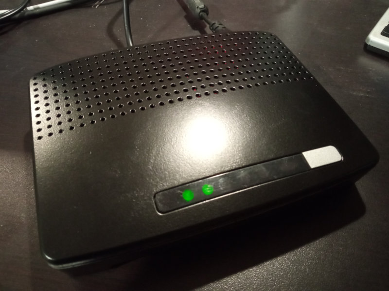

## Arduino PowerController features
- handles RaspberryPi power via relay;
- does case cooling controlling a fan with PWM, reading temperature with a thermistor;
- since it's connected to RaspberryPi via UART, it can detect when android system is full booted, and can send shutdown command to it when user presses power button. After some seconds, cuts RaspberryPi power deactivating relay;
- drives the leds on the original modem board using different patterns for standby, booting and shutdown phases (I've reused a slice of the original modem pcb, cut with a grinder);

## Arduino code
The arduino code is very simple, and is built with PlatformIO on VisualStudio Code. All the code is in src/main.cpp.
I tried to do my best to make code very clean and simple, and with full comments.

## AndroidTV system setup
I've downloaded and installed LineageOS 18.1 Android TV (Android 11) (by KonstaGANG): https://konstakang.com/devices/rpi4/LineageOS18-ATV/
I've installed it on a 32GB microSD.

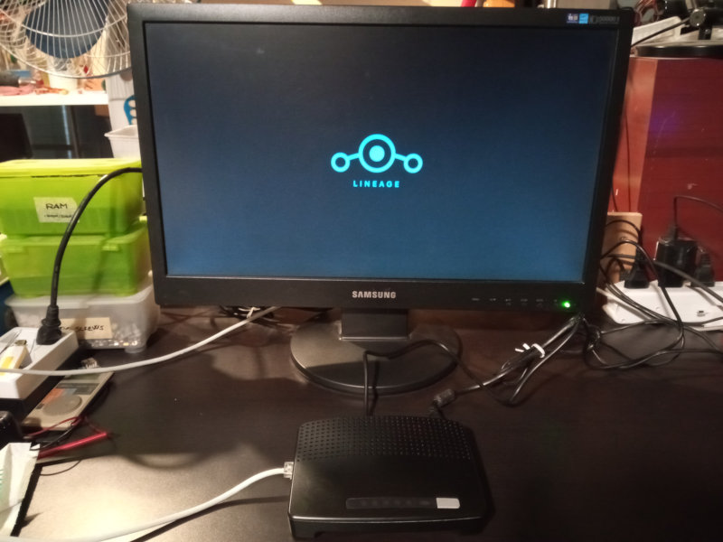
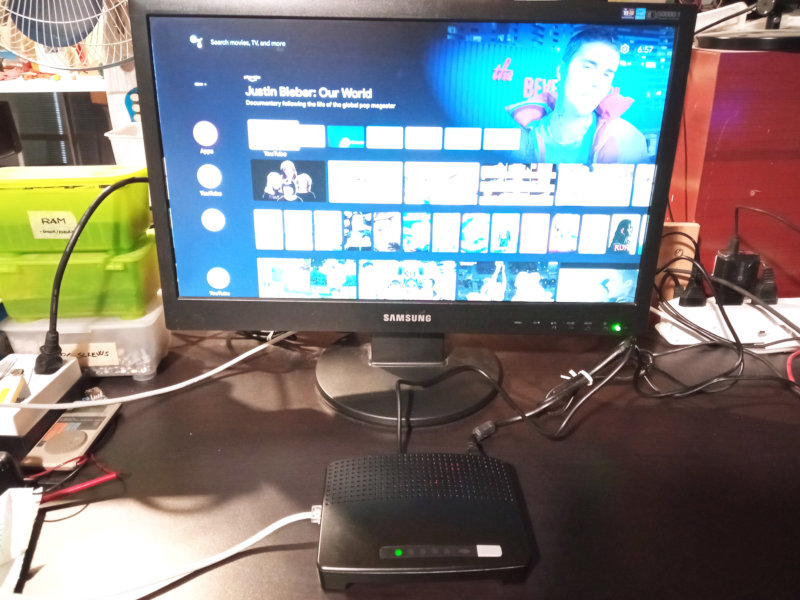

## Case adaptations
I had this old modem, found some time ago in local dumpster. It's perfect for my needs (right dimensions, nice looking design, and many ventilation holes, all around case).

*case donor device, an old Technicolor TG582n, coming from the dumpster*

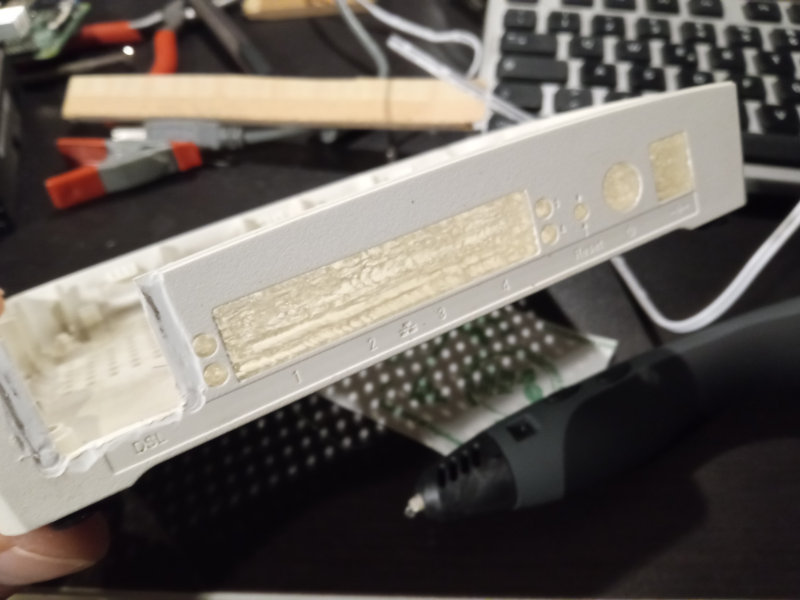
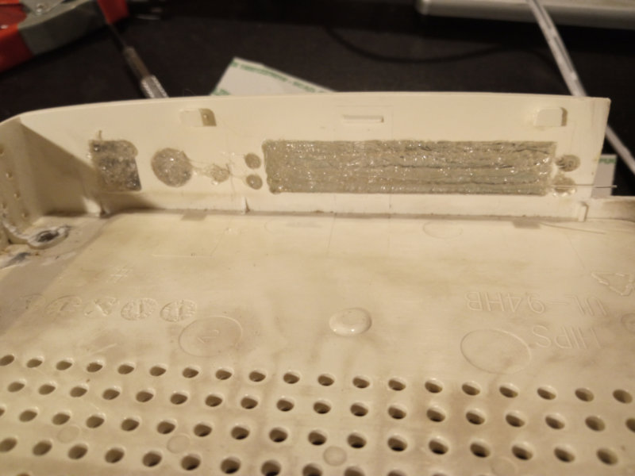
*filled unneeded holes with a 3D pen*
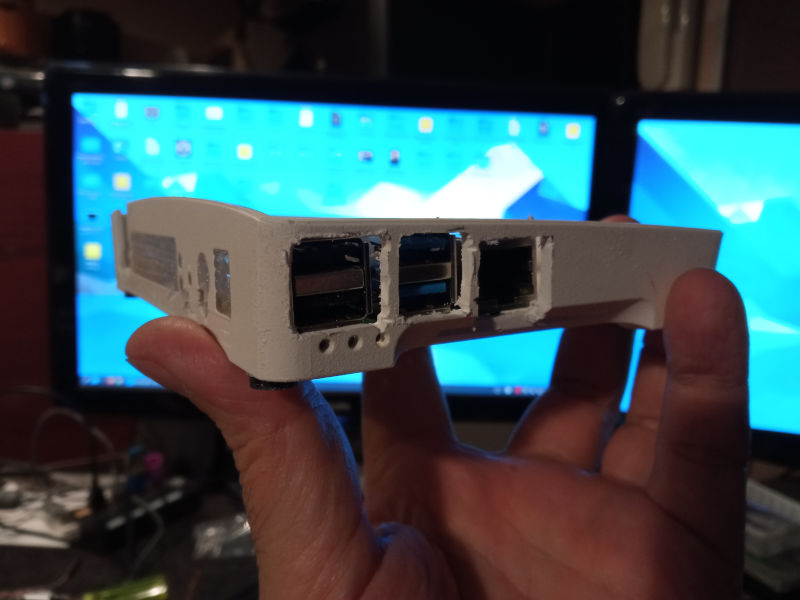
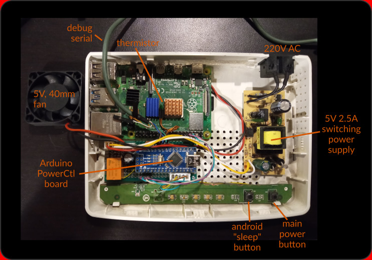
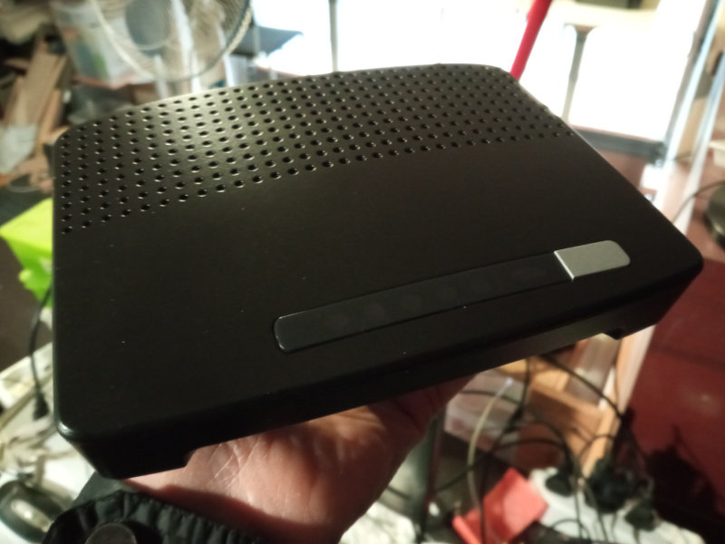
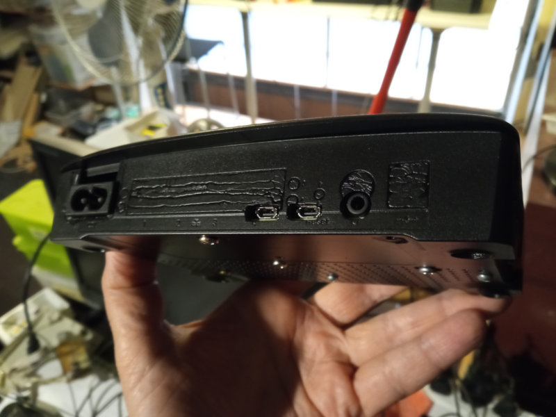

### Original modem PCB modifications
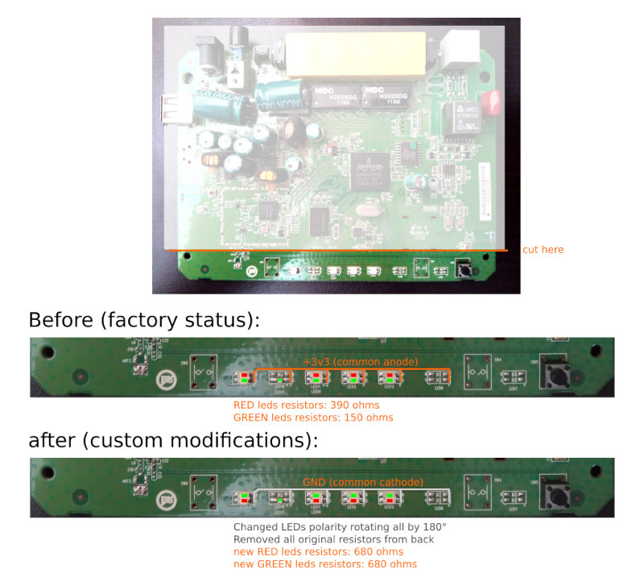

### Complete circuit schematics
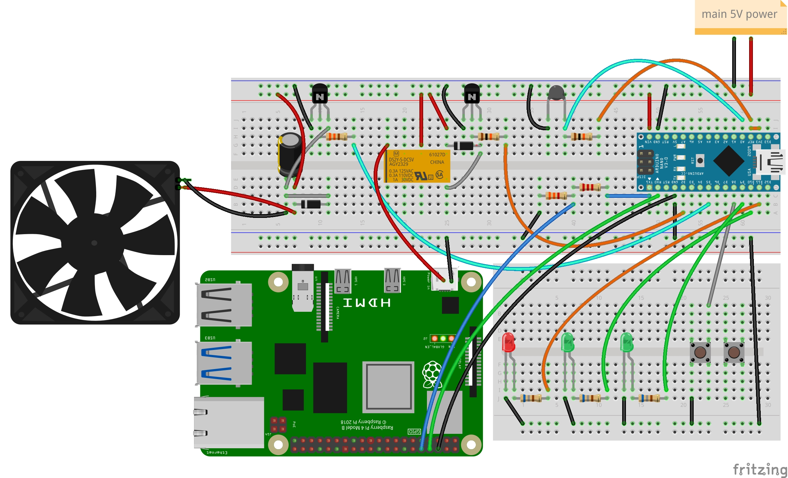
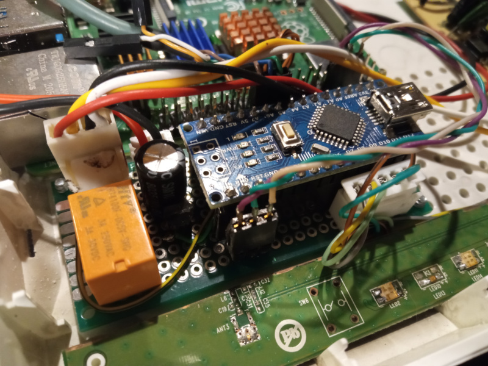
Note:
 - for fan control, i've used a C2001 NPN transistor (Ic=700mA), and capacitor is 1000uF 16V (to avoid pwm audible noise);
 - relay is 5V 3A, driver transistor is a generic NPN (i.e: BC547);
 - thermistor is a 10K type;
 - on Arduino TX there is a level converter made with a voltage divider (R1: 2k2, R2: 3k3), to avoid damage on RaspberryPi UART;

(fritzing and pdf files are under docs/ directory)

