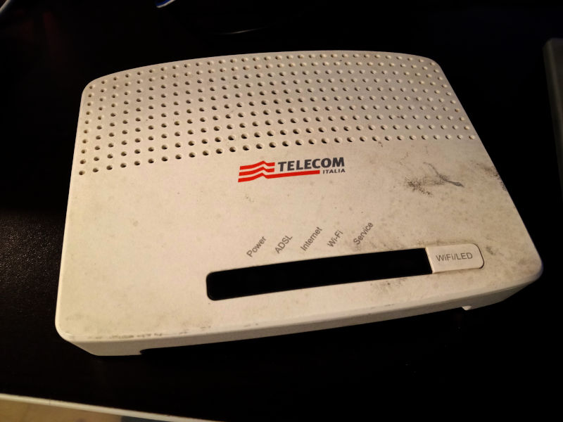
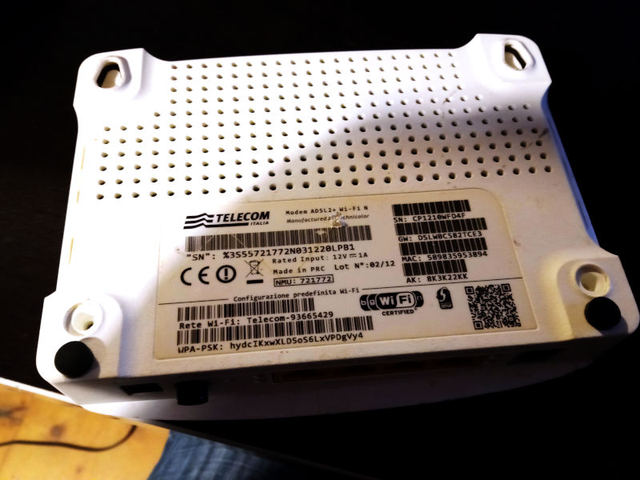
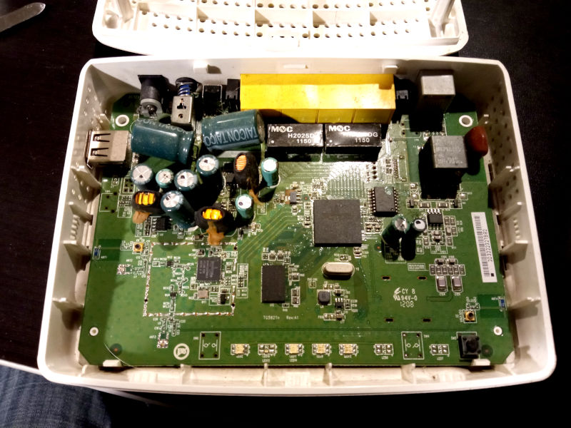

# RaspberryPi 4 Android TV with Arduino-based PowerController
This repository contains the source code, all the schematics and some words on the build process of a mediacenter device I've built with a RaspberryPi4 SBC, an Arduino Nano, and a case of an old Technicolor TG582n ADSL modem.

## Arduino PowerController features
- handles RaspberryPi power via relay;
- does case cooling controlling a fan with PWM, reading temperature with a thermistor;
- since it's connected to RaspberryPi via UART, it can detect when android system is full booted, and can send shutdown command to it when user presses power button;
- drives the leds on the original modem board using different patterns for standby, booting and shutdown phases (I've reused a part of the original modem pcb, cut with a grinder);

## Arduino code
The arduino code is very simple, and is built with PlatformIO on VisualStudio Code. All the code is in src/main.cpp

## Build process
I had this old modem i've found some time ago in local dumpster. It's perfect for my needs (right dimensions, nice looking design, and many ventilation holes, all around case).

*case donor device, an old Technicolor TG582n, coming from the dumpster*

